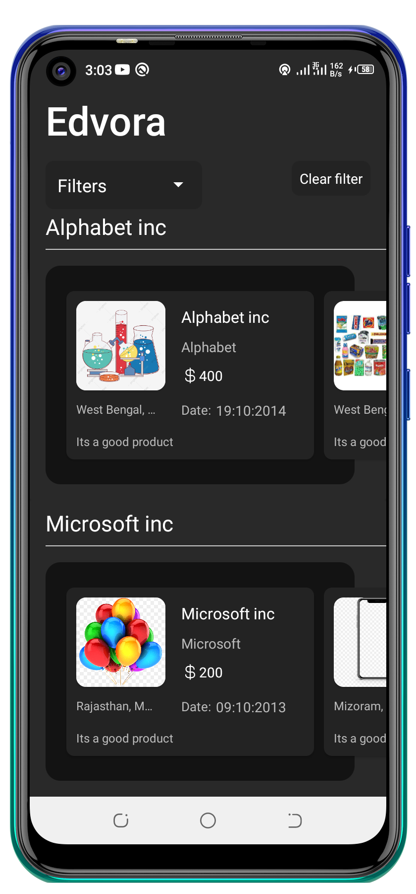
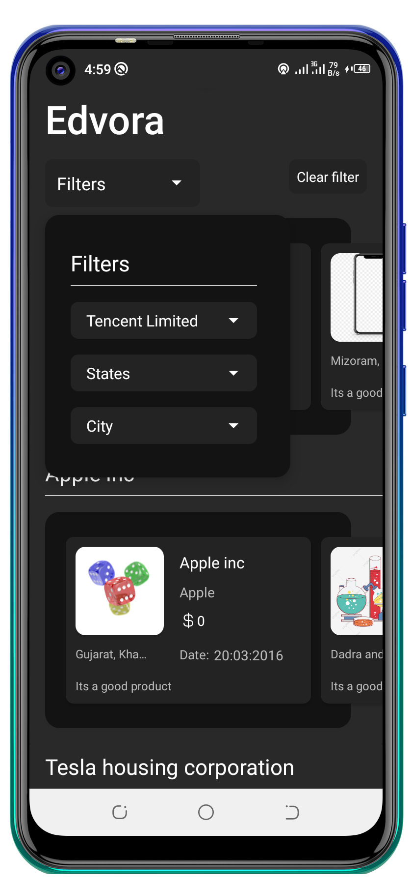

## EdvoraAndroidTest

An simple Android App for Edvora Android Assessment. It consumes the [edvora assessment api](https://assessment-edvora.herokuapp.com/) to display random Products which needs to be grouped and be displayed in a Nested Recyclerview. The app is built with the MVVM architecture and some Jetpack Libraries

## Instructions:

API: GET: 
URL = https://assessment-edvora.herokuapp.com

The api data will be random. A single list will contain all the products. 

You will be provided with a list of products. Name of the Product will be the Name of the Company it belongs to.

The products must be categorized in the list format as depicted in the UI. 

### Example, 
If a product name is Shoes, it will be categorized under the list of Shoes.

The product list is horizontal scrollable list. 

## Dropdown functionalities
- Products - dropdown should be the list of product names. The content of dropdown will be all the product names received in list of products in api call. 
- State - dropdown needs to be the list of State Names extracted from the list of products. 
- City - dropdown needs to be the list of City Names extracted from the list of products. The dropdown should only show list of cities of the selected state only. 

> Download the apk [here](https://drive.google.com/file/d/130nNypGue8uT7hdm8ROKA-2DPNTEs2Qc/view?usp=sharing)

## Screenshots
These are the app's screenshots:

## Demo

https://user-images.githubusercontent.com/50293753/146783624-bd19fd6c-27ae-4959-a308-578db6cfd4ac.mp4

## Project characteristics
This project brings to table set of best practices, tools, and solutions:
- 100% Kotlin
- Model-View-View Model Architecture
- Android Jetpack
- Dependency Injection
- Material design

 ## Tech Stack.
- [Kotlin](https://developer.android.com/kotlin) - Kotlin is a programming language that can run on JVM. Google has announced Kotlin as one of its officially supported programming languages in Android Studio; and the Android community is migrating at a pace from Java to Kotlin
- [Lifecycle](https://developer.android.com/topic/libraries/architecture/lifecycle) - Perform actions in response to a change in the lifecycle status of another component, such as activities and fragments.
- [Viewmodel](https://developer.android.com/topic/libraries/architecture/viewmodel) -The ViewModel class is designed to store and manage UI-related data in a lifecycle conscious way
- [LiveData](https://developer.android.com/topic/libraries/architecture/livedata) -  A lifecycle-aware data holder with the observer pattern
- [Kotlin Coroutines](https://developer.android.com/kotlin/coroutines) - A concurrency design pattern that you can use on Android to simplify code that executes asynchronously.
- [View Binding](https://developer.android.com/topic/libraries/data-binding/) - Allows you to bind UI components in your layouts to data sources in your app using a declarative format rather than programmatically.
- [Retrofit](https://square.github.io/retrofit) -  Retrofit is a REST Client for Java and Android by Square inc under Apache 2.0 license. Its a simple network library that used for network transactions. By using this library we can seamlessly capture JSON response from web service/web API.
- [GSON](https://github.com/square/gson) - JSON Parser,used to parse requests on the data layer for Entities and understands Kotlin non-nullable and default parameters.
- [Flow](https://developer.android.com/kotlin/flow) - In coroutines, a flow is a type that can emit multiple values sequentially, as opposed to suspend functions that return only a single value.
- [Hilt](https://developer.android.com/training/dependency-injection/hilt-android) -  A dependency injection library for Android that reduces the boilerplate of doing manual dependency injection in your project
- [Logging Interceptor](https://github.com/square/okhttp/blob/master/okhttp-logging-interceptor/README.md) -  logs HTTP request and response data.
- [Material Libarary](https://material.io/develop/android) -  Modular and customizable Material Design UI components for Android
- [Glide](https://github.com/bumptech/glide)- An image loading and caching library for Android focused on smooth scrolling.
